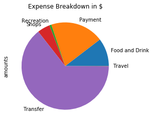
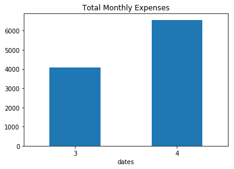
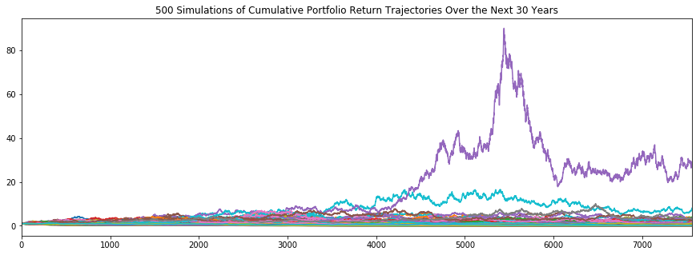
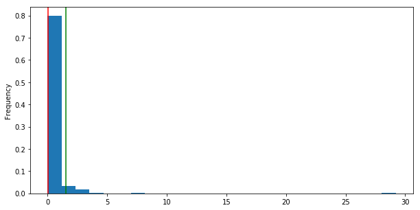

# Between a Rock and a Hard Place - How a Traditional 60/40 Portfolio Fails to Maintain a Lifestyle in Retirement 

### Expenses

Our budget analysis shows elevated recent monthly expenses driven in large part by  significant Transfer expenses.

### Income

We assume that projected annual net income of 6,085 dollars will be maintained until retirement. Note that we assume the elevated expenses described above are subtracted from annual gross income to arrive at net income.

## Retirement Planning - A Few Potential Lottery Outcomes, Most Simulations Project Modest, but Positive Returns

The traditional 60% stock/40% bond portfolio was evaluated via 2 large ETFs that serve as proxies for US equities (SPY) and bonds (AGG)

Running 500 simulations for 30 years of returns indicates a 90% probability that a 20,000 initial investment will return between 20,199 dollars and 50,828 dollars. At first glance, these simulations suggest an extremely low likelihood of portfolio loss. Increasing the initial investment to 30,000 dollars shifted this 90% probability range to 30,298 dollars and 76,243 dollars.

We also note the tight band around probable portfolio values suggests a very low likelihood of outsized returns beyond the bands indicated by the calculated confidence intervals.

### Absolute Portfolio Gains are Misleading Compared to Income and Retirement Needs 

We determined that an initial investment of 20,000 dollars has a 90% probability of generating a 4% withdrawal between ~808 dollars and 2,033 dollars after 30 years.
Increasing this initial investment to 30,000 dollars only raised this withdrawal range to ~1,212 dollars and 3,049 dollars. 
Absent realization of one of the few extremely high performances simulated, the investor will almost certainly not be able to replace 6,045 dollars in net income in 30 years with this portfolio, initial investment and withdrawal rate.

## Conclusions

The significant spread between the desired withdrawal rate and a reasonable best-case scenario for the portfolio value after 30 years suggests:
1. The investor should attempt to significantly reduce expenses in order to drive net income higher. Transfer expenses presents a clear opportunity for cost reductions.
2. The investors should also consider allocating more funds to the initial investment.
3. Lastly, the investor may need to consider adjusting the portfolio mix more towards equities. Given the 30-year time horizon, a higher equity weighting may smooth out volatility over the long term and more importantly, generate higher risk-adjusted returns.

